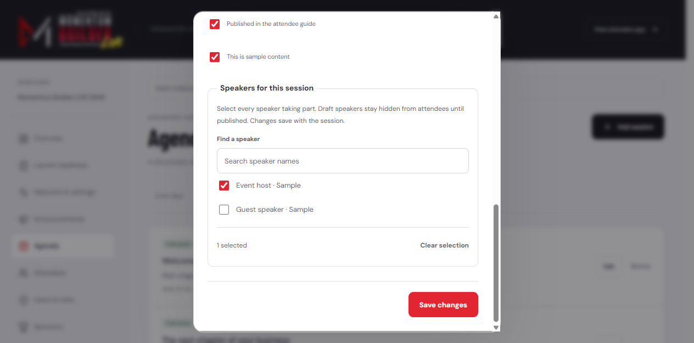
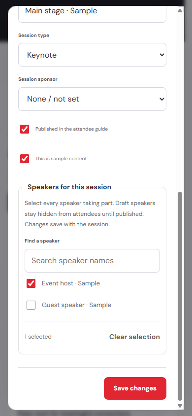

# PRD-001 implementation qualification

Date: 2026-09-29. Branch: `feat/event-operator-console`, based on `main` at `96fb04c` (merged PR #6). This is source/local qualification, not a production sign-off.

## Scope and changes

The September 29 parent decisions govern this increment. Speaker/sponsor list buttons were already merged; this work makes their saves image-only instead of resending older content. Form and list uploads share preflight format/size validation and retain the existing server's actual image decoding, WebP encoding, event-scoped public storage, and verification.

Session forms now load current speaker assignments, offer a searchable multi-select with draft labels, and commit session fields and join-table changes together through `admin_save_agenda_session`. Missing link/lookup data blocks saving. Existing link IDs survive unchanged assignments, duplicate inputs do not create duplicate links, and invalid or failed writes roll back the whole change. No extra speaker-ID column, sort-order column, check-in table, or public guide field was introduced.

The migration uses SECURITY INVOKER, an explicit current-event Admin check, the existing event RLS, and authenticated-only RPC execution. Server routes derive the event from the authorized actor and reject forged fields and origins. Existing composite foreign keys, audit triggers, publication filtering, timezone conversion, and review-reopen behavior remain active. The session form links an imported source question back to Launch readiness.

## Verified source checks

Lint, TypeScript, **174 tests in 22 files**, and the production Next.js build passed. The baseline before this increment was 145 tests; 29 new unit/API/image/SQL tests were added.

The clean full Chromium rerun passed **121 tests with three intentional device-specific skips**. Mobile WebKit passed **26 tests with no skips**. The new operator file contributes six scenarios on each of desktop Chromium, mobile Chromium and mobile WebKit, including scoped axe checks of the session and speaker edit dialogs. Exact browser statistics and source fingerprints are recorded in [`qualification.json`](./qualification.json). Screenshots below were visually inspected against the actual local production build in demo mode; they are not production account screenshots.

## Acceptance mapping

| Criteria | Evidence | Boundary |
|---|---|---|
| Parent AC-1/AC-2; 001a AC-1a/AC-1c | `operator-session.test.ts`, `operator-api.test.ts`, retained `event-roles.test.ts` and `rpc-permissions.test.ts`: Admin/event authorization, Member/Sponsor/unverified/foreign-event refusal, explicit anonymous RPC denial | Production `team@momentumbuilder.com` access has not been assigned by this change |
| Parent AC-3; 001b AC-2f | Real PGlite anonymous-role queries prove unpublished speakers/sessions/links remain hidden; existing guide/public privacy tests remain in the suite | PGlite runs the actual migrations/RLS; it is not hosted Supabase |
| Parent AC-4; 001b AC-2d/AC-2e/AC-2g | Route tests assert invalidation after confirmed saves only. SQL and browser tests exercise event-timezone edits, end-before-start refusal, speaker add/remove/retry/reload, and atomic rollback. Existing attendee rendering and mobile suites remain regression gates | A production attendee refresh after a live edit remains a deployment check |
| Parent AC-5; 001b AC-2a/AC-2b/AC-2c | Image-only field/event-scoped route tests; real Sharp JPEG/PNG/WebP decoding and output checks; exact 3 MB boundary, disguised/empty/unsupported inputs, verification failure; list/form browser flows | Browser upload transport and storage service are fixtures; no real organizer asset was replaced |
| Parent AC-6; 001a AC-1d | Real local demo API responses are 409; browser forms retain the read-only error; role/demo tests preserved | No demo-mode mutation override was added |
| 001b review requirement | SQL proves a reviewed session edit reopens the question; browser shows the review reminder; existing no-op/review-version tests retained | Speaker-link-only changes retain the existing trigger semantics |

## Browser methodology

The session browser fixture runs the real UI and actual PostgreSQL migration/RLS/RPC through PGlite with a synthetic event. It verifies failed saves preserve typed form state and persisted assignments, successful retries persist, and reload restores the selected speaker. It does not exercise hosted Auth, PostgREST, or private WebSocket delivery. Upload browser tests separately check request shape, error retention, retry, and the distinction between immediate list save and pending form state. Actual image-byte handling is covered by the route tests with real Sharp.

The full Chromium suite retains attendee, privacy, role, messaging, offline, logo, and responsive checks. Mobile WebKit now includes the operator workflows. Scoped axe scans cover the session and speaker edit dialogs. Manual visual review used the unchanged official logo and original attendee layout.

The first upload-browser run exposed a test locator that also matched Next's empty route-announcement alert; the locator was scoped to organizer content. A full regression run exposed a pre-existing guide-refresh test reading a transient duplicate DOM node. Its assertion now waits for exactly one visible updated summary, then still verifies alert ordering and that held sessions are not promoted. No attendee implementation was changed for either test correction.

## Visual review





The form stays within the viewport, the speaker choices and clear action remain usable, and the save action remains reachable by scrolling. The screenshots use clearly labeled synthetic demo content.

## Reproduction

```text
npm run check
npm run test:e2e
npm run test:mobile:webkit
```

With no `PLAYWRIGHT_BASE_URL` override, Playwright starts the built demo server on port 3100. The qualification run uses an isolated local production server on port 3111 via that override. No secrets are needed for the fixture tests.

## Remaining release/operator work

Apply the additive `20260929154113_event_operator_session_save.sql` migration to dedicated Event Beast project `nyhzmazbfctuttizwnxp` before releasing the new editor, then deploy and verify the real organizer upload/save/attendee-refresh path. Run the hosted security advisor after applying the migration; source tests are not a hosted-advisor result. Assign and verify `team@momentumbuilder.com` through the existing `/admin/users` workflow as a separate owner/operator step. No production role, content, email gate, DNS, domain, or billing changes were made here.

001c door check-in and 001d editable help/logo remain deferred. Keep this PRD in `in-work` until the approved release and real production handoff are recorded; do not move it to `completed` based solely on local tests.
